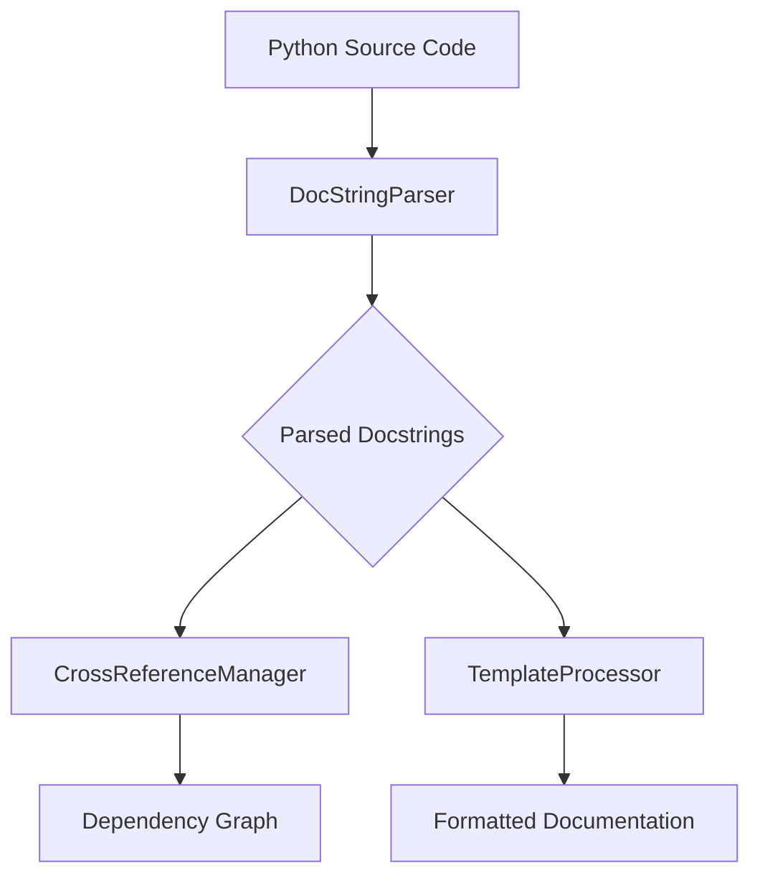

# MCP Documentation System: Comprehensive Documentation

## Overview

The MCP (Model Context Protocol) Documentation System is an advanced, automated documentation generation pipeline designed to transform Python docstrings into comprehensive, context-aware documentation.

## Architecture

### Core Components

1. **DocStringParser**
   - Extracts structured information from Python docstrings
   - Supports complex docstring formats
   - Handles metadata extraction

2. **TemplateProcessor**
   - Converts parsed docstrings into formatted documentation
   - Supports multiple output formats (Markdown, HTML)
   - Uses Jinja2 templating engine

3. **CrossReferenceManager**
   - Analyzes dependencies between modules
   - Generates cross-reference links
   - Creates dependency graph visualizations

## Workflow



## Installation

```bash
pip install -r requirements.txt
```

## Usage

### Running Tests

```bash
pytest tests/documentation/
```

### Generating Documentation

```bash
python run_tests.py
```

## Configuration

### Docstring Format

Example docstring:

```python
def example_function(param1: str, param2: int) -> bool:
    """
    A sample function demonstrating docstring format.

    Args:
        param1: Description of first parameter
        param2: Description of second parameter

    Returns:
        A boolean result
    """
    return len(param1) > param2
```

## Testing Strategy

- Unit Tests: Validate individual component functionality
- Integration Tests: Ensure end-to-end documentation generation
- Coverage: >90% test coverage

## Contributing

1. Fork the repository
2. Create a feature branch
3. Implement changes
4. Write/update tests
5. Submit Pull Request

## License

MIT License

## Future Roadmap

- [ ] Support multiple programming languages
- [ ] Enhanced template customization
- [ ] AI-assisted documentation improvements
- [ ] Performance optimizations

## Known Limitations

- Currently supports Python docstrings
- Requires Jinja2 templating engine
- Limited to module-level documentation

## Contact

For questions or support, please open an issue in the GitHub repository.
